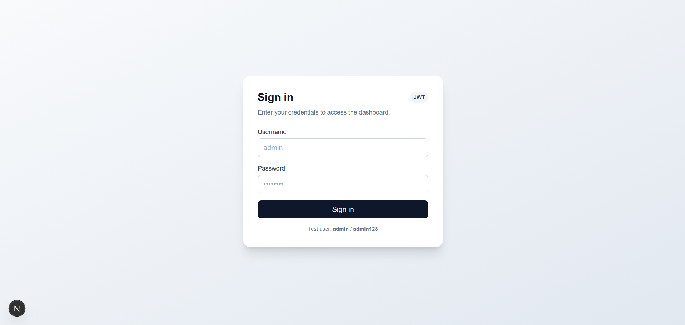
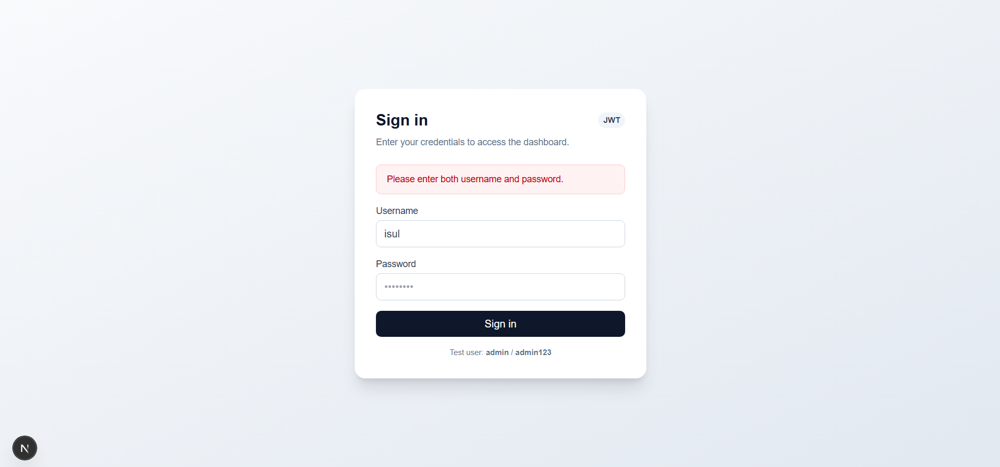
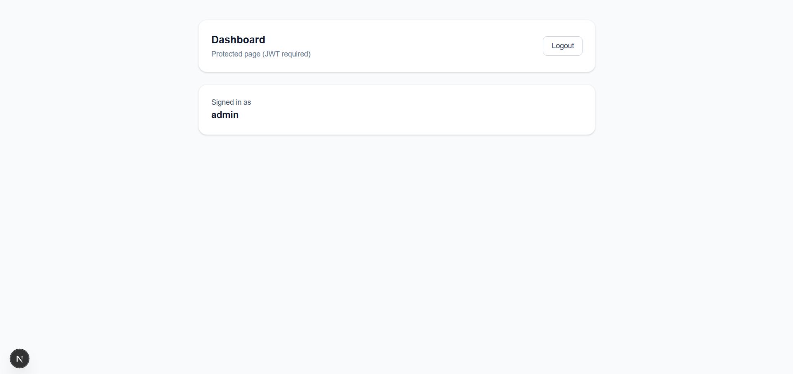
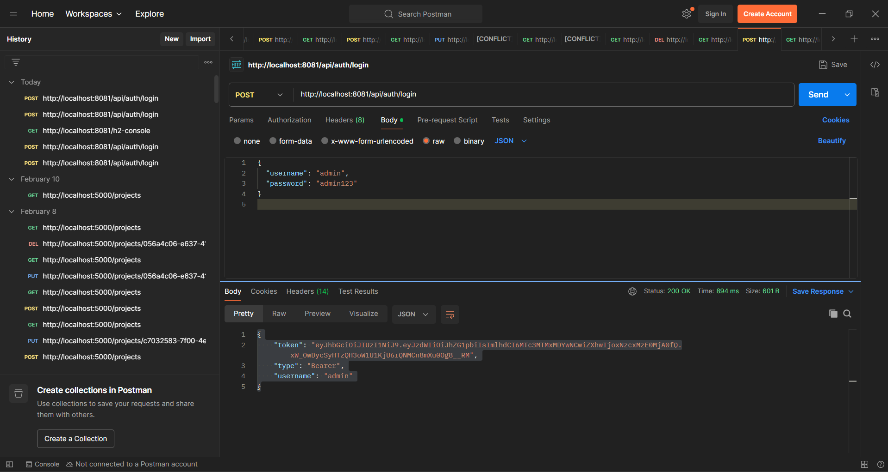

# 🔐 Full Stack JWT Login System

A full-stack authentication system built with **Spring Boot + Spring Security + JWT + Next.js + TypeScript + TailwindCSS**.

---

## 🚀 Features
- Secure login with JWT authentication
- Spring Security backend protection
- Password encryption (BCrypt)
- Protected API routes
- Token-based authentication
- Responsive modern UI
- Form validation + error handling
- Logout functionality

---

## 🛠 Tech Stack

### Backend
- Spring Boot
- Spring Security
- JWT
- Spring Data JPA
- H2 Database

### Frontend
- Next.js (App Router)
- TypeScript
- Tailwind CSS

---

## 📂 Project Structure

```

project-root
├── backend
└── frontend

````

---

## ⚙️ Backend Setup

```bash
cd backend
mvn spring-boot:run
````

Server runs on:

```
http://localhost:8081
```

---

## 💻 Frontend Setup

```bash
cd frontend
npm install
npm run dev
```

Runs on:

```
http://localhost:3000
```

---

## 🔑 Test Credentials

```
username: admin
password: admin123
```

---

## 🔗 API Endpoints

### Login

```
POST /api/auth/login
```

Body:

```json
{
  "username":"admin",
  "password":"admin123"
}
```

---

### Protected Route

```
GET /api/user/me
Authorization: Bearer TOKEN
```

---

## 📸 Screenshots

### Login Page




### Dashboard



### Api-test


---

## 🔐 Authentication Flow

```
Login → Backend verifies → JWT generated → Token stored → Protected routes accessible
```

---

## 📌 Security Implementation

* Stateless authentication
* Token validation filter
* Password hashing
* Route authorization
* CORS configuration

---

## 👨‍💻 Author

**Isul Nethila**
Full Stack Developer

---

